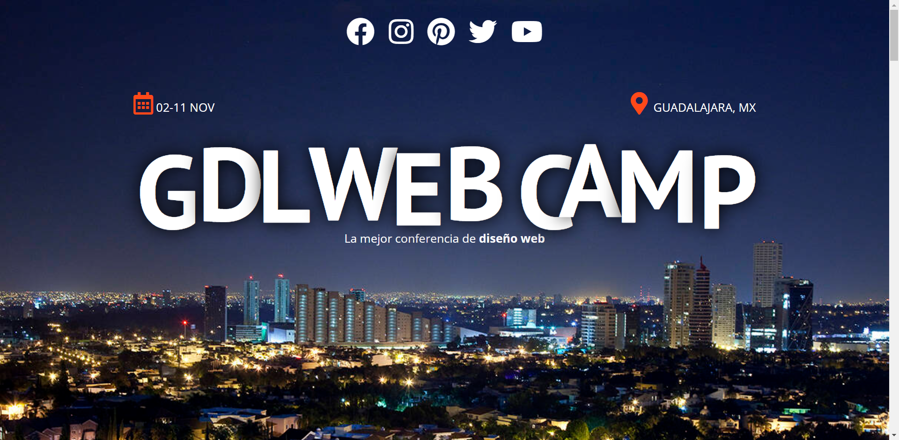
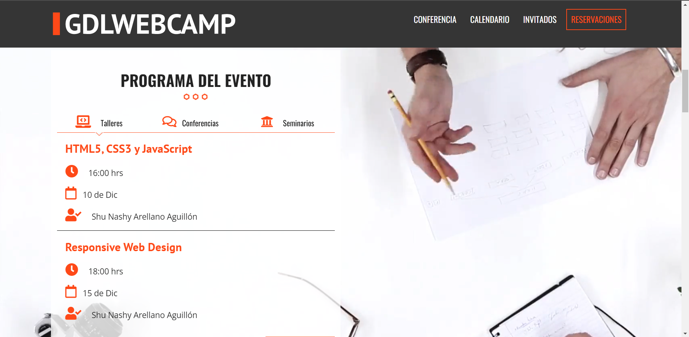
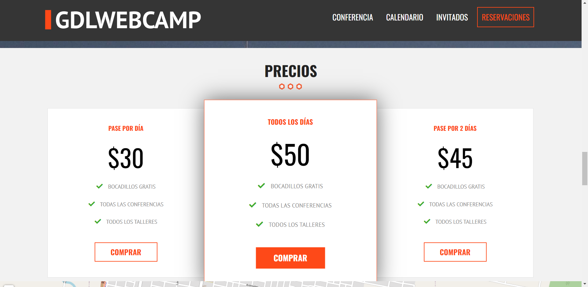
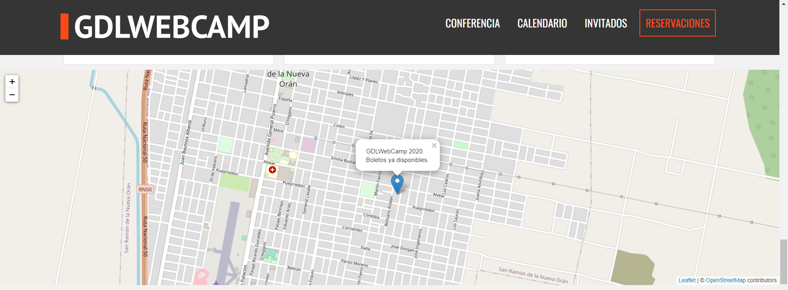
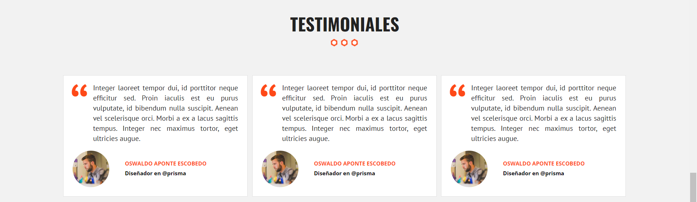
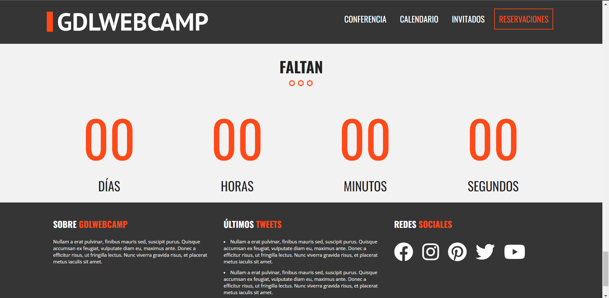
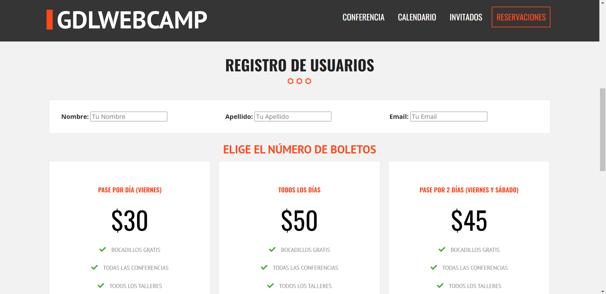
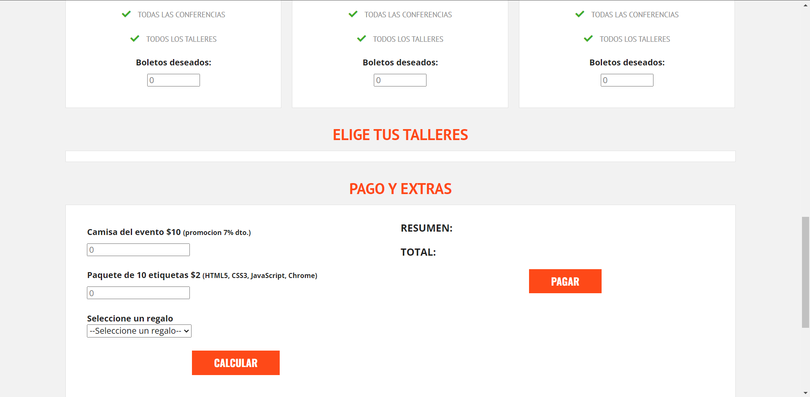
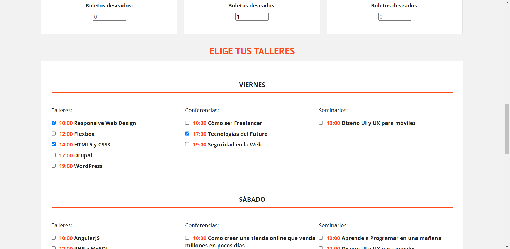
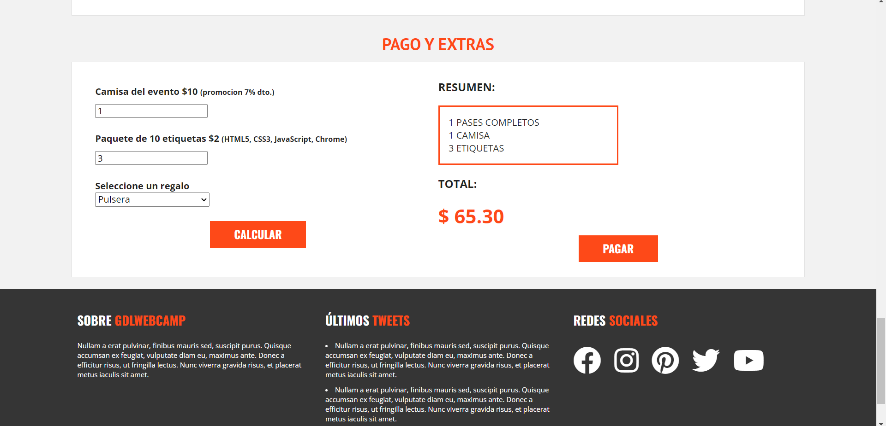

# Sitio web para conferencias (Responsive)

Este proyecto es una página web adaptable a dispositivos de distintos tamaños (este tipo de sitio web se conoce en inglés como "responsive").

El propósito de esta página web es que los usuarios puedan pagar por sus entradas y reservar sus registros de la conferencia de diseño web. Incluye diferentes apartados como:

- Una breve descripción del evento
- Programa del evento (talleres y horarios)
- Listado de precios
- Galería de fotos
- Mapa interactivo para visualizar la ubicación del evento
- Testimoniales
- Reservaciones

También incluye imágenes alternativas en la carpeta **img** en caso de que se desee personalizar las imágenes principales y el vídeo de fondo.

## Capturas de pantalla:
### Primera parte de la página web

### Programa del evento:

### Invitados:

### Listado de precios:

### Mapa interactivo:

### Testimoniales:

### Contacto:

### Registro de usuarios:

### Reservaciones:

### Elección de talleres:

### Pago y extras:

## Tecnologías
- HTML
- CSS
- JavaScript
- MySQL

Además, se incluyeron **Google Fonts** para personalizar la fuente y **Flaticon** para incorporar íconos como logos de redes sociales populares.
